# Architecture

How the home k3s cluster is put together: NixOS, k3s, Tailscale, and the
fitness app deployment.

---

## 1. Deployment Architecture

```mermaid
graph TB
    subgraph "Proxmox"
        subgraph "VM: app-node"
            direction TB
            A[NixOS<br/>stateVersion 26.05<br/>hosts/app-node/default.nix + flake.nix]
            B[k3s server<br/>single-node<br/>embedded SQLite<br/>no etcd]
            C[Docker daemon<br/>for building images]
            D[Tailscale<br/>WireGuard VPN<br/>Tailscale Serve]

            subgraph "k8s Namespace: curam-fitness"
                E[Postgres 18<br/>Deployment<br/>PVC: 5Gi]
                F[Backend<br/>Deployment<br/>curam-backend:latest]
                G[Backup<br/>CronJob<br/>pg_dump weekly]
            end

            A -->|systemd services| B
            A -->|systemd service| C
            A -->|systemd service| D
            B --> E
            B --> F
            B --> G
        end
    end

    subgraph "Tailnet"
        H[Your laptop<br/>Tailscale client] -->|WireGuard| D
        I[Your phone<br/>Tailscale client] -->|WireGuard| D
    end

    D -->|:80 → 127.0.0.1:8080| F
    F -->|:5432| E

    style A fill:#0d1b2a,stroke:#5271ff
    style B fill:#0d1b2a,stroke:#646cff
    style D fill:#1a2a1a,stroke:#0fff81
    style E fill:#0d1b2a,stroke:#ffd700
    style F fill:#0d1b2a,stroke:#646cff
```



### What runs where

| Process | Type | Managed by |
| --------- | ------ | ----------- |
| NixOS | OS config | `hosts/app-node/default.nix` + `flake.nix` |
| k3s | Kubernetes server | systemd unit (`k3s.service`) |
| Docker | Container daemon | systemd unit (`docker.service`) |
| Tailscale | VPN + proxy | systemd units + `tailscale-serve.nix` |
| Postgres | k8s Deployment | `kubectl apply` |
| Backend | k8s Deployment | `kubectl apply` |
| Backup | k8s CronJob | `kubectl apply` |

---

## 2. Module Architecture

```mermaid
graph TB
    subgraph "flake.nix"
        A[nixpkgs<br/>nixos-unstable] --> B[nixosConfigurations.app-node]
    end

    subgraph "hosts/app-node/default.nix"
        direction TB
        C[imports]
        D[Host config]
        E[Firewall]
        F[fail2ban]
        G[SSH hardening]
        H[Auto-upgrades]
        I[Kernel sysctl]
        J[Healthcheck timer]
        K[Packages]
    end

    B --> C

    subgraph "modules/"
        M[tailscale-serve.nix<br/>Tailscale Serve proxy]
        N[docker.nix<br/>Docker daemon + auto-prune]
    end

    C --> M
    C --> N

    D --> E
    D --> F
    D --> G
    D --> H
    D --> I
    D --> J
    D --> K

    style L fill:#0d1b2a,stroke:#646cff
    style M fill:#0d1b2a,stroke:#0fff81
    style N fill:#0d1b2a,stroke:#ffd700
```



### Configuration decisions

| Setting | Value | Why |
| --------- | ------- | ----- |
| `networking.firewall.enabled` | `true` | Blocks everything except 22/tcp and 6443/tcp |
| `networking.firewall.trustedInterfaces` | `tailscale0` | All Tailscale traffic allowed (VPN enforces auth) |
| `services.fail2ban.enable` | `true` | 3 SSH retries → 1h ban |
| `services.openssh.startWhenNeeded` | `true` | Socket-activated, not always running |
| `system.autoUpgrade.enable` | `true` | Daily at 4am. No auto-reboot. |
| `networking.nftables.enable` | `true` | Coordinates fail2ban + firewall on same backend |
| `boot.kernel.sysctl` | hardened | No source routing, redirects, or sysrq |

---

## 3. Build + Deploy Pipeline

```mermaid
sequenceDiagram
    participant Dev as Dev Machine
    participant VM as VM (app-node)
    participant K8s as k3s
    participant DB as Postgres

    rect rgb(20, 40, 20)
        Note over Dev,DB: First-time setup
        Dev->>VM: git clone nix-config
        Dev->>VM: git clone curam/fitness
        Dev->>VM: ./scripts/setup-secrets.sh
        Dev->>VM: age-keygen + sops encrypt
        Note over Dev,VM: Prompts for API keys, outputs .enc.yaml
    end

    rect rgb(20, 20, 40)
        Note over VM,K8s: Build Docker image
        VM->>VM: ./scripts/build-app.sh /opt/curam/fitness
        VM->>VM: docker build -t curam-backend:latest
        VM->>VM: docker save | k3s ctr images import
    end

    rect rgb(40, 20, 20)
        Note over VM,DB: Deploy manifests
        VM->>K8s: kubectl apply -k manifests/curam-fitness/
        K8s->>K8s: Create postgres deployment + PVC
        K8s->>K8s: Create backend deployment + ConfigMap
        K8s->>K8s: Create backup cronjob
        VM->>K8s: sops --decrypt ... | kubectl apply -f -
        K8s->>DB: Run database migrations
    end

    rect rgb(20, 40, 20)
        Note over Dev,DB: App update cycle
        Dev->>VM: git pull curam/fitness
        VM->>VM: ./scripts/build-app.sh /opt/curam/fitness
        VM->>K8s: kubectl rollout restart deploy/backend
        K8s->>K8s: Pod replaced with new image
    end
```



### Build step details

```bash
# scripts/build-app.sh
docker build -t curam-backend:$(date +%Y%m%d-%H%M%S) /opt/curam/fitness
docker tag curam-backend:latest
docker save curam-backend:latest | sudo k3s ctr images import -
kubectl -n curam-fitness rollout restart deploy/backend
```

The `docker save ... | k3s ctr images import -` pattern pushes the image into
k3s's built-in containerd without a registry. No Docker Hub, no Harbor, no
auth needed.

---

## 3b. Proxmox image builds

Each NixOS host wired for image builds (`hosts/{media,rocinante,app-node}`
import `proxmox-image.nix` and carry a `proxmox.nix`) exposes
`system.build.VMA`, which produces a Proxmox backup archive:

```bash
nix build .#nixosConfigurations.<host>.config.system.build.VMA
# → result/vzdump-qemu-<host>.vma.zst
```

Restore it on the PVE host with `qmrestore` (see `README.md` → "New Proxmox
VM setup"). Note: the image module's `cptofs` step (LKL) has a hardcoded
`mem=100M` that OOMs on large closures — `hosts/app-node/proxmox.nix`
carries a small overlay patching it to 4G; port that to other hosts if their
image builds hit "cptofs failed".

---

## 4. Networking

```mermaid
flowchart LR
    subgraph "Internet"
        A[Internet]
    end

    subgraph "Tailnet"
        B[Tailscale DERP relays]
    end

    subgraph "Home LAN"
        C[Proxmox node<br/>192.168.1.x]
        D[VM: app-node<br/>192.168.68.133]
    end

    subgraph "VM Processes"
        E[Tailscale<br/>100.x.x.x:80]
        F[Firewall<br/>nftables]
        G[k3s API<br/>:6443]
        H[Backend<br/>:8080]
        I[SSH<br/>:22]
        J[Tailscale Serve<br/>:80 → :8080]
    end

    A -.->|WireGuard UDP| B
    B -->|tunnel| E
    E --> J
    J --> H
    H --> G

    C -->|LAN| D
    D --> F
    F --> I
    F --> G

    style E fill:#1a2a1a,stroke:#0fff81
    style F fill:#2a1a1a,stroke:#ff5252
    style J fill:#1a2a1a,stroke:#0fff81
```



### Ports

| Port | Protocol | Allowed from | Purpose |
| ------ | ---------- | ------------- | --------- |
| 22 | TCP | Tailscale + LAN | SSH (socket-activated, key-only) |
| 80 | TCP | Tailscale only | Tailscale Serve → Backend :8080 |
| 443 | TCP | Tailscale only | Tailscale Serve HTTPS |
| 6443 | TCP | Tailscale + LAN | k3s API (kubectl) |
| 41641 | UDP | Internet | Tailscale WireGuard (outbound to DERP) |

**No ports are forwarded from the internet.** Tailscale's WireGuard tunnel
establishes outbound to Tailscale's DERP relays; inbound connections come
through that tunnel. The firewall on the VM is defense-in-depth — even if
Tailscale had a bug, the nftables rules block everything except SSH and k3s.

---

## 5. Secrets Management

```mermaid
flowchart LR
    subgraph "Dev machine"
        A[age-keygen<br/>~/.config/sops/age/keys.txt]
    end

    subgraph "Git"
        B[.sops.yaml<br/>age public key]
        C[secrets/curam-secrets.enc.yaml<br/>sops-encrypted k8s Secret]
    end

    subgraph "VM deploy step"
        D[sops --decrypt<br/>needs age private key]
        E[kubectl apply -f -]
    end

    subgraph "k3s"
        F[Secret: curam-secrets<br/>Namespace: curam-fitness]
    end

    subgraph "Backend pod"
        G[DATABASE_URL]
        H[JWT_SECRET]
        I[ANTHROPIC_API_KEY]
        J[RESEND_API_KEY]
        K[SYNC_API_KEY]
    end

    A -->|public key| B
    A -->|encrypts| C
    B --> C
    C --> D
    A -.->|private key<br/>NOT in git| D
    D --> E
    E --> F
    F -->|envFrom secretRef| G
    F --> H
    F --> I
    F --> J
    F --> K

    style A fill:#1a1a2e,stroke:#ffd700
    style C fill:#1a1a2e,stroke:#ff5252
    style F fill:#0d1b2a,stroke:#646cff
```



### Secrets in the Secret

| Key | Source | Required? |
| ----- | -------- | ----------- |
| `database_url` | Generated from `db_password` | ✅ Yes |
| `db_password` | `openssl rand -hex 32` | ✅ Yes |
| `jwt_secret` | `openssl rand -hex 64` | ✅ Yes |
| `anthropic_api_key` | Prompted from user | ✅ Yes (coach) |
| `sync_api_key` | `openssl rand -hex 48` with `cu_` prefix | ✅ Yes |
| `resend_api_key` | Prompted from user | ❌ No (emails skip) |
| `hevy_webhook_jwt_secret` | `openssl rand -hex 64` | ❌ No (webhooks unused) |

### Key security properties

- **Encrypted at rest in git.** The `.enc.yaml` file is committed. Only someone
  with the age private key can decrypt it.
- **Decrypted on deploy.** `sops --decrypt ... | kubectl apply -f -` — the
  plaintext Secret never touches disk.
- **The age private key is the root secret.** If lost, all secrets are
  unrecoverable. Back it up to a password manager.

---

## 6. Backup + Restore

```mermaid
flowchart LR
    subgraph "k3s Cluster"
        A[Postgres Pod] -->|pg_dump| B[Backup Pod<br/>CronJob: Sun 3am]
        B -->|gzip + write| C[/var/backups/curam/<br/>on VM host]
    end

    subgraph "Retention"
        C --> D[Last 4 backups<br/>rolling 4-week window]
    end

    subgraph "Restore paths"
        E[Loss: data only] --> F[1. kubectl scale backend=0]
        F --> G[2. gunzip + psql restore]
        G --> H[3. kubectl scale backend=1]

        I[Loss: VM disk]<br/>I[<br/>Loss: VM disk] --> J[1. New VM + NixOS install]
        J --> K[2. Clone nix-config + curam/fitness]
        K --> L[3. sops --decrypt secrets]
        L --> M[4. Restore DB from backup]
        M --> N[5. Rebuild Docker image]
        N --> O[6. kubectl apply -k]
    end

    style C fill:#1a1a2e,stroke:#ffd700
    style D fill:#1a1a2e,stroke:#ffd700
```

### What's in git vs what's not

| In git | Not in git |
| -------- | ----------- |
| `flake.nix` + `hosts/app-node/` + `modules/` | Age private key |
| `manifests/curam-fitness/*.yaml` | Anthropic / Resend API keys |
| `secrets/curam-secrets.enc.yaml` | Postgres data |
| `docs/*.md` | k3s cluster state (snapshots) |

The cluster is fully recoverable from git + a Postgres dump. The only
non-recoverable items are the API keys stored in the age-encrypted secret —
back those up to a password manager.

---

## 7. Full Setup Flow

```mermaid
flowchart TB
    subgraph "Before you start"
        A[Install age] --> B[Generate age key]
        B --> C[Paste public key into .sops.yaml]
        D[Generate SSH key] --> E[Paste public key into hosts/app-node/default.nix]
    end

    subgraph "Proxmox"
        F[Create VM<br/>2 vCPU, 4GB RAM, 40GB disk]
        G[Boot NixOS minimal ISO]
        H[Install NixOS from flake]
        F --> G --> H
    end

    subgraph "First boot"
        I[ssh with keypair]
        J[tailscale up]
    end

    subgraph "Deploy"
        K[git clone nix-config]
        L[git clone curam/fitness]
        M[./scripts/setup-secrets.sh]
        N[./scripts/build-app.sh /opt/curam/fitness]
        O[sops --decrypt secrets | kubectl apply -f -]
        P[kubectl apply -k manifests/curam-fitness/]
    end

    subgraph "Verify"
        Q[curl http://localhost:8080/api/health]
        R[Open http://app-node/ on phone]
    end

    H --> I
    I --> J
    J --> K
    K --> L
    L --> M
    M --> N
    N --> O
    O --> P
    P --> Q
    Q --> R
```
